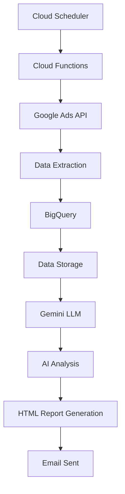

# Marketing Data Pipeline

An automated marketing data collection, analysis, and reporting pipeline. Integrates Google Ads API, BigQuery, and Gemini LLM to automatically generate daily marketing performance reports.

## 🚀 Key Features

- **Data Collection**: Real-time campaign data collection via Google Ads API
- **Data Storage**: Data warehouse construction using BigQuery
- **AI Analysis**: Marketing data analysis and insight generation using Gemini LLM
- **Report Generation**: Automated daily reports in HTML format
- **Cloud Deployment**: Serverless deployment via Google Cloud Functions

## 📋 System Requirements

- Python 3.8+
- Google Cloud Platform account
- Google Ads API access
- Gemini API key

## 🛠️ Installation and Setup

### 1. Clone Repository
```bash
git clone <repository-url>
cd marketing-data-pipeline
```

### 2. Install Dependencies
```bash
pip install -r requirements.txt
```

### 3. Environment Variables Setup
Create a `.env` file and configure the following variables:

```env
# Gemini API Configuration
GEMINI_API_KEY=your_gemini_api_key_here

# BigQuery Configuration (Optional)
GCP_PROJECT_ID=marketing-automation-473220
BIGQUERY_DATASET_ID=marketing_data
```

### 4. Google Ads API Setup
1. Create a Google Ads API developer account
2. Configure authentication information in `google-ads.yaml`:
```yaml
developer_token: "your_developer_token"
client_id: "your_client_id"
client_secret: "your_client_secret"
refresh_token: "your_refresh_token"
customer_id: "your_customer_id"
```

### 5. Google Cloud Setup
1. Create a project in Google Cloud Console
2. Enable BigQuery API
3. Create a service account and download authentication key
4. Set environment variables:
```bash
export GOOGLE_APPLICATION_CREDENTIALS="path/to/service-account-key.json"
```

## 🏗️ Project Structure

```
marketing-data-pipeline/
├── main.py                 # Main pipeline code
├── google-ads.yaml        # Google Ads API configuration
├── credentials.json       # Gmail API credentials (if using email)
├── token.json            # Gmail API token (auto-generated)
├── requirements.txt      # Python dependencies
├── .env                 # Environment variables
├── .gitignore           # Git ignore file
└── README.md           # Project documentation
```

## 🔧 Usage

### Local Testing
```bash
# Run complete pipeline
python main.py

# Run with specific date
python -c "from main import marketing_report_pipeline; result = marketing_report_pipeline('2024-01-15'); print('Status:', result['status'])"
```

### Cloud Functions Deployment
```bash
# Deploy to Google Cloud Functions
gcloud functions deploy marketing-pipeline \
  --runtime python39 \
  --trigger-http \
  --allow-unauthenticated \
  --source . \
  --entry-point main
```

### Cloud Scheduler Setup
```bash
# Set up daily execution at 9 AM
gcloud scheduler jobs create http daily-marketing-report \
  --schedule="0 9 * * *" \
  --uri="https://your-region-your-project.cloudfunctions.net/marketing-pipeline" \
  --http-method=POST \
  --headers="Content-Type=application/json" \
  --message-body='{"report_date":"$(date +%Y-%m-%d)"}'
```

## 📊 Pipeline Workflow



## 🔍 Key Functions

### `marketing_report_pipeline(report_date)`
Main function that executes the complete marketing pipeline.

**Parameters:**
- `report_date` (str, optional): Report date (default: yesterday)

**Returns:**
```python
{
    "status": "success",
    "report_date": "2024-01-15",
    "pipeline_completed": True,
    "pipeline_duration_seconds": 8.28,
    "results": {
        "data_extraction": {...},
        "data_loading": [...],
        "analysis": {...},
        "report_generation": "...",
        "email_sending": "..."
    }
}
```

### `extract_google_ads_data(report_date)`
Extracts campaign data from Google Ads API.

### `load_data_to_warehouse(data, source_name, report_date)`
Stores data in BigQuery.

### `run_analysis_and_anomaly_detection(report_date)`
Analyzes data using Gemini LLM.

### `generate_report_content(analysis_results)`
Generates HTML format report.

## 📈 Data Schema

### BigQuery Table: `google_ads_daily`
```sql
CREATE TABLE `project.dataset.google_ads_daily` (
  channel STRING NOT NULL,
  campaign_name STRING NOT NULL,
  impressions INTEGER,
  clicks INTEGER,
  spend FLOAT64,
  cpc FLOAT64,
  conversions INTEGER,
  cost_per_conversion FLOAT64,
  report_date DATE NOT NULL,
  uploaded_at TIMESTAMP NOT NULL
);
```

## 🧪 Testing

### Local Testing Execution
```bash
# Check environment variables
python -c "import os; from dotenv import load_dotenv; load_dotenv(); print('GEMINI_API_KEY:', 'Set' if os.getenv('GEMINI_API_KEY') else 'Not set')"

# Test complete pipeline
python main.py
```

### Test Results Verification
- Pipeline Status: `success`
- Execution Time: ~30-35 seconds
- Data Extraction: Campaign data collection from Google Ads
- Data Storage: Data upload to BigQuery
- AI Analysis: Insight generation via Gemini LLM
- Report Generation: HTML format report creation

## 🚨 Error Handling

The pipeline continues to the next step even if errors occur in each stage:

- **Data Extraction Failure**: Continue analysis with existing data
- **Data Storage Failure**: Continue with analysis
- **AI Analysis Failure**: Generate basic report
- **Report Generation Failure**: Pipeline completes with error message

## 📝 Logging

Detailed logs are output at every step:
```
INFO:main:Starting marketing report pipeline for 2024-01-15
INFO:main:Step 1: Extracting Google Ads data...
INFO:main:✓ Google Ads data extraction completed: 3 rows
INFO:main:Step 2: Loading data to warehouse...
INFO:main:✓ Data loading completed: 3 rows uploaded
INFO:main:Step 3: Running analysis and anomaly detection...
INFO:main:✓ Analysis completed: 3 rows analyzed
INFO:main:Step 4: Generating report content...
INFO:main:✓ Report generation completed: 8709 characters
INFO:main:Marketing report pipeline completed in 33.43 seconds
```

## 🔒 Security Considerations

- API keys managed via environment variables
- `.env` file added to `.gitignore`
- Minimize Google Cloud service account permissions
- API communication via HTTPS

## 🚀 Deployment and Operations

### Cloud Functions Environment Variables Setup
```bash
gcloud functions deploy marketing-pipeline \
  --set-env-vars GEMINI_API_KEY=your_key,GCP_PROJECT_ID=your_project_id
```

### Monitoring
- Check Cloud Functions logs
- Monitor BigQuery data quality
- Verify pipeline execution status

## 📋 Dependencies

Key Python packages required:
- `google-ads` - Google Ads API client
- `google-cloud-bigquery` - BigQuery client
- `google-generativeai` - Gemini LLM client
- `pandas` - Data manipulation
- `python-dotenv` - Environment variable management

**Last Updated**: September 2025
**Version**: 2.0.0